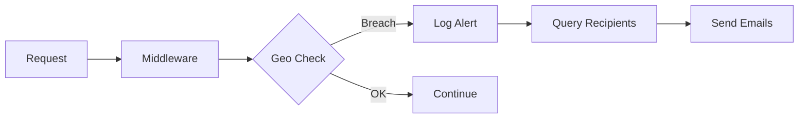

# Sistema de Notificaciones de Seguridad - OzyBase

## 📧 Descripción General

El Sistema de Notificaciones de Seguridad de OzyBase proporciona alertas en tiempo real por correo electrónico cuando se detectan eventos críticos de seguridad, permitiendo una respuesta inmediata a amenazas potenciales.

## 🎯 Características Principales

### 1. **Detección Automática de Amenazas**
- **Geo-Fencing Breaches**: Alertas cuando se detecta acceso desde países no autorizados
- **Unauthorized Access**: Notificaciones de intentos de acceso no autorizados
- **Rate Limit Exceeded**: Avisos de patrones de solicitudes sospechosos

### 2. **Notificaciones Multi-Destinatario**
- Soporte para múltiples destinatarios de email
- Configuración granular de tipos de alerta por destinatario
- Activación/desactivación individual de destinatarios

### 3. **Envío Asíncrono**
- Las notificaciones se envían en segundo plano sin afectar el rendimiento
- Sistema de cola para garantizar la entrega
- Logs detallados de cada notificación enviada

## 🚀 Configuración

### Backend

#### 1. Migraciones de Base de Datos
Las tablas necesarias se crean automáticamente al iniciar OzyBase:

```sql
-- Tabla de destinatarios de notificaciones
_v_security_notification_recipients (
    id UUID PRIMARY KEY,
    email VARCHAR(255) NOT NULL,
    alert_types TEXT[] DEFAULT ARRAY['geo_breach', 'unauthorized_access', 'rate_limit_exceeded'],
    is_active BOOLEAN DEFAULT TRUE,
    created_at TIMESTAMPTZ DEFAULT NOW()
)
```

#### 2. Configurar Mailer
Por defecto, OzyBase usa `LogMailer` que imprime los emails en la consola. Para producción, implementa un mailer real:

```go
// Ejemplo con SendGrid, AWS SES, etc.
type ProductionMailer struct {
    apiKey string
}

func (m *ProductionMailer) SendSecurityAlert(to, alertType, details string) error {
    // Implementar lógica de envío real
    return sendEmail(to, alertType, details)
}
```

### Frontend

#### Acceso a la Configuración
1. Navega a **Authentication > Alert Notifications**
2. Agrega emails de destinatarios
3. Configura los tipos de alerta por destinatario

## 📊 API Endpoints

### GET /api/project/security/notifications
Obtiene la lista de destinatarios configurados.

**Response:**
```json
[
  {
    "id": "uuid",
    "email": "admin@company.com",
    "alert_types": ["geo_breach", "unauthorized_access"],
    "is_active": true,
    "created_at": "2026-02-03T14:00:00Z"
  }
]
```

### POST /api/project/security/notifications
Agrega un nuevo destinatario de notificaciones.

**Request:**
```json
{
  "email": "security@company.com",
  "alert_types": ["geo_breach", "rate_limit_exceeded"]
}
```

### DELETE /api/project/security/notifications/:id
Elimina un destinatario de notificaciones.

## 🔔 Tipos de Alertas

### 1. Geo Breach (geo_breach)
**Trigger**: Cuando se detecta acceso desde un país no autorizado en la política de Geo-Fencing.

**Contenido del Email**:
```
Subject: ⚠️ SECURITY ALERT: Geographic Access Breach

A critical security event has been detected:

Type: Geographic Access Breach
Details: IP: 185.20.12.3 from Russia, Moscow attempted to access POST /api/collections/users/records

Date: Mon, 03 Feb 2026 14:30:00 EST
Action Required: Check your OzyBase Dashboard immediately.
```

### 2. Unauthorized Access (unauthorized_access)
**Trigger**: Múltiples intentos fallidos de autenticación.

### 3. Rate Limit Exceeded (rate_limit_exceeded)
**Trigger**: Cuando un cliente excede los límites de tasa configurados.

## 🛠️ Flujo de Trabajo



1. **Request Interceptado**: El middleware captura cada petición
2. **Validación de Seguridad**: Se ejecutan las políticas (Geo-Fencing, RBAC, etc.)
3. **Detección de Brecha**: Si se detecta una violación, se registra en `_v_security_alerts`
4. **Consulta de Destinatarios**: Se obtienen todos los emails activos para ese tipo de alerta
5. **Envío Asíncrono**: Se envían las notificaciones en goroutines separadas
6. **Logging**: Cada email enviado se registra en la consola (LogMailer) o sistema de logs

## 📈 Mejores Prácticas

### 1. **Configuración de Destinatarios**
- Usa emails de equipos (security@, devops@) en lugar de individuales
- Mantén al menos 2 destinatarios activos para redundancia
- Revisa periódicamente la lista de destinatarios

### 2. **Gestión de Alertas**
- No ignores las alertas de geo_breach - investiga cada una
- Configura filtros en tu cliente de email para priorizar alertas de OzyBase
- Establece un SLA de respuesta (ej: 15 minutos para alertas críticas)

### 3. **Integración con Sistemas Externos**
- Considera integrar con PagerDuty, Slack o Microsoft Teams
- Usa webhooks para enviar alertas a sistemas SIEM
- Implementa un dashboard de monitoreo 24/7

### 4. **Testing**
```bash
# Simular una brecha de geo-fencing
curl -X POST http://localhost:5342/api/collections/test/records \
  -H "Authorization: Bearer YOUR_TOKEN" \
  -H "X-Forwarded-For: 185.20.12.3"
```

## 🔐 Seguridad

- Los emails de notificación **NO** contienen información sensible (tokens, passwords)
- Solo se envían detalles necesarios para la investigación (IP, país, endpoint)
- Los destinatarios deben tener acceso al dashboard para ver detalles completos

## 🐛 Troubleshooting

### Las notificaciones no se envían
1. Verifica que hay destinatarios activos: `SELECT * FROM _v_security_notification_recipients WHERE is_active = true`
2. Revisa los logs del servidor para errores de mailer
3. Confirma que la política de Geo-Fencing está habilitada

### Emails duplicados
- Verifica que no hay destinatarios duplicados en la base de datos
- Revisa que el middleware no está siendo llamado múltiples veces

### Formato incorrecto
- Asegúrate de que el Mailer implementa correctamente la interfaz `SendSecurityAlert`

## 📚 Recursos Adicionales

- [Documentación de Geo-Fencing](./GEO_FENCING.md)
- [RBAC Configuration](./RBAC.md)
- [Security Dashboard](./SECURITY_DASHBOARD.md)

---

**Versión**: 1.0.0  
**Última actualización**: 2026-02-03  
**Autor**: OzyBase Security Team
