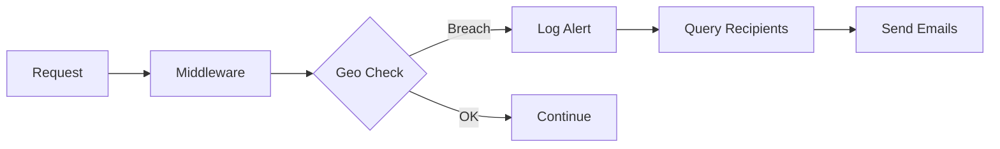

# Security Notifications System - OzyBase

## 📧 Overview

The OzyBase Security Notification System provides real-time email alerts when critical security events are detected, enabling immediate incident response.

## 🎯 Key Features

### 1. **Automated Threat Detection**
- **Geo-Fencing Breaches**: Alerts when access is detected from unauthorized countries.
- **Unauthorized Access**: Notifications for suspicious or unauthenticated requests.
- **Rate Limit Exceeded**: Alerts for request throttling violations.

### 2. **Multi-Recipient Notifications**
- Support for multiple email notification recipients.
- Granular configuration of alert types per recipient.
- Individual activation/deactivation of recipients.

### 3. **Asynchronous Dispatch**
- Notifications run in background goroutines without impacting API performance.
- Internal queuing mechanism for reliable delivery.
- Detailed execution logs for each dispatched alert.

## 🚀 Setup

### Backend

#### 1. Database Schema
Notification tables are created automatically on boot:

```sql
-- Security notification recipients table
_v_security_notification_recipients (
    id UUID PRIMARY KEY,
    email VARCHAR(255) NOT NULL,
    alert_types TEXT[] DEFAULT ARRAY['geo_breach', 'unauthorized_access', 'rate_limit_exceeded'],
    is_active BOOLEAN DEFAULT TRUE,
    created_at TIMESTAMPTZ DEFAULT NOW()
)
```

#### 2. Mailer Configuration
By default, OzyBase uses `LogMailer` which logs alerts to stdout. For production, configure SMTP settings in the dashboard or via environment variables.

```go
type ProductionMailer struct {
    apiKey string
}

func (m *ProductionMailer) SendSecurityAlert(to, alertType, details string) error {
    return sendEmail(to, alertType, details)
}
```

### Frontend

#### Accessing Settings
1. Navigate to **Authentication > Alert Notifications**.
2. Add recipient emails.
3. Configure target alert types per recipient.

## 📊 API Endpoints

### GET /api/project/security/notifications
Fetch configured recipients.

**Response:**
```json
[
  {
    "id": "uuid",
    "email": "admin@company.com",
    "alert_types": ["geo_breach", "unauthorized_access"],
    "is_active": true,
    "created_at": "2026-02-03T14:00:00Z"
  }
]
```

### POST /api/project/security/notifications
Add a new alert recipient.

**Request:**
```json
{
  "email": "security@company.com",
  "alert_types": ["geo_breach", "rate_limit_exceeded"]
}
```

### DELETE /api/project/security/notifications/:id
Remove an alert recipient.

## 🔔 Alert Types

### 1. Geo Breach (`geo_breach`)
**Trigger**: Access detected from an unauthorized country under the Geo-Fencing policy.

**Sample Email**:
```
Subject: ⚠️ SECURITY ALERT: Geographic Access Breach

A critical security event has been detected:

Type: Geographic Access Breach
Details: IP 185.20.12.3 from Russia attempted to access POST /api/collections/users/records

Date: Mon, 03 Feb 2026 14:30:00 EST
Action Required: Check your OzyBase Dashboard immediately.
```

### 2. Unauthorized Access (`unauthorized_access`)
**Trigger**: Multiple unauthenticated or failed access attempts.

### 3. Rate Limit Exceeded (`rate_limit_exceeded`)
**Trigger**: Client exceeds defined request rate thresholds.

## 🛠️ Execution Workflow


```mermaid
graph LR
    A[Request] --> B[Middleware]
    B --> C{Geo Check}
    C -->|Breach| D[Log Alert]
    D --> E[Query Recipients]
    E --> F[Send Emails]
    C -->|OK| G[Continue]
```

1. **Intercepted Request**: Middleware captures incoming HTTP request.
2. **Security Validation**: Policies (Geo-Fencing, RBAC, Rate Limiting) are evaluated.
3. **Breach Detection**: Logged to `_v_security_alerts`.
4. **Recipient Query**: Queries active notification recipients matching alert type.
5. **Async Delivery**: Dispatches email alerts in goroutines.
6. **Audit Log**: Dispatches entry to system logs.

## 📈 Best Practices

1. Use team distribution emails (e.g. `security@company.com`).
2. Maintain at least 2 active recipients for redundancy.
3. Regularly review active notification recipients in the dashboard.

---

**Version**: 1.0.0  
**Updated**: 2026-07-26  
**Author**: OzyBase Security Team
